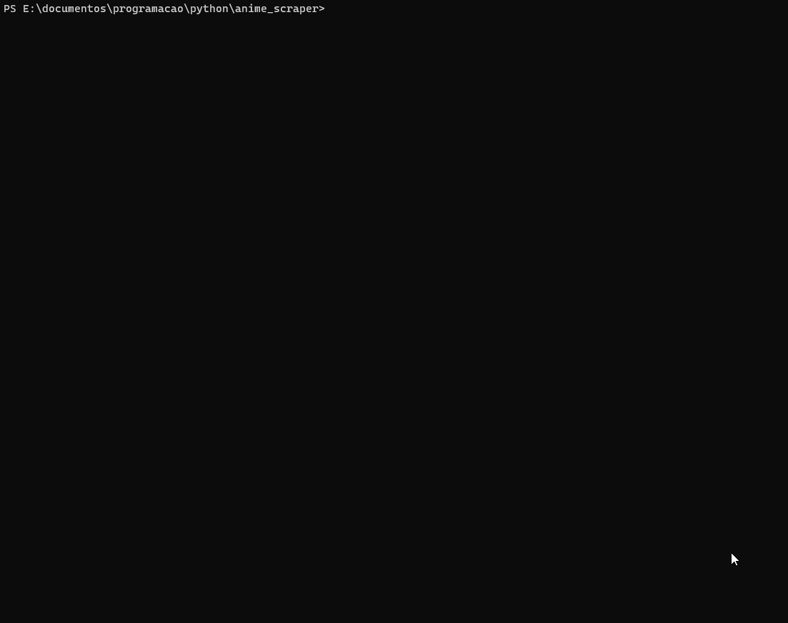

# Anime Downloader

## Esse scraper baixa animes do site Anbient

### Descrição


Um pequeno script em python para baixar animes do site Anbient.Basta passar uma parte do nome do anime.
Exemplo: 'Fate/Stay Night' pode ser encontrado passando apenas a palavra 'fate'.
Se quiser passar mais de uma palavra apenas passe com hífens como por Exemplo:
Para encontrar 'sword art online' digite 'sword-art-online'.

### Instalação
to Install the script just clone the repository with `git clone https://github.com/GMkonan/anime_scraper.git`
and install the dependencies in requirements with `pip install -r requirements.txt`

## Exemplos:

### Argumentos

**O script aceita argumentos opcionais**

#### Range
Seleciona para baixar os episodios entre o range especificado.
```-r range  O range de episodios q quer baixar```
```Python anime.py -r 1-5 fate```
Caso nenhum range seja especificado você tera de marcar os episodios:


**Aperte 'a' e de Enter para baixar todos os episodios.**

#### Diretorio
Especifica o diretorio onde você quer salvar os eps.
```-d diretorio O caminho da pasta onde os animes serão baixados```
```python anime.py -d E:/animes/Nisemonogatari nisemonogatari```
Caso não seja especificado o script ira criar uma caminho 'animes/{nome_anime}'
dentro do diretorio onde o script esta.